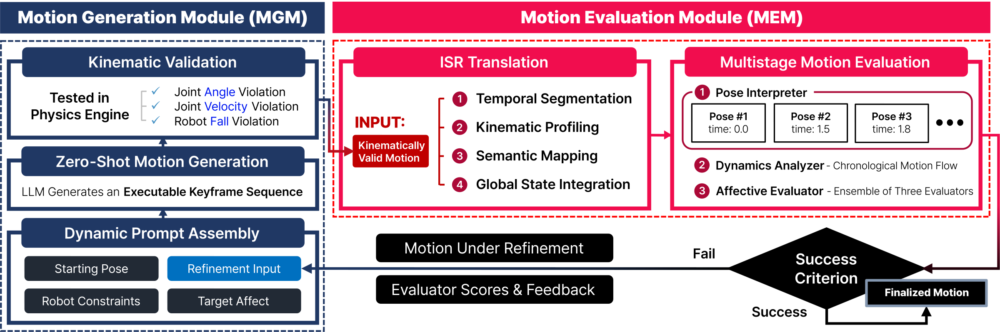
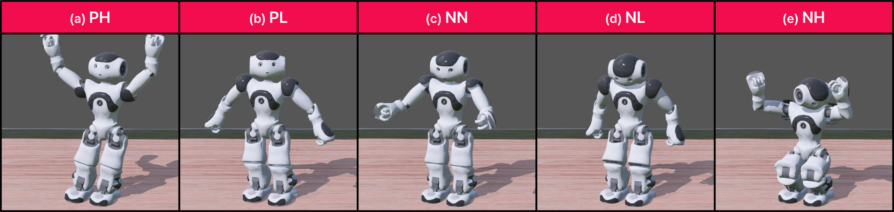
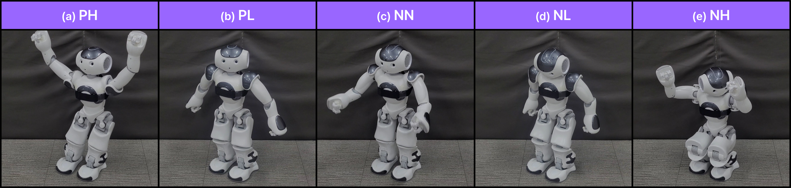

<div align="center">
  <h1>PACE</h1>
  <p><strong>Core Components for Affective Robot Motion</strong></p>
  <p>Reference components supporting motion generation, kinematic validation, intermediate semantic representation, and automated affective evaluation.</p>
</div>

<p align="center">
  <a href="#framework">Framework</a> ·
  <a href="#overview">Overview</a> ·
  <a href="#reference-setup">Reference Setup</a> ·
  <a href="#motion-examples">Motion Examples</a> ·
  <a href="#repository-structure">Repository Structure</a> ·
  <a href="#configuration-before-use">Configuration</a>
</p>

## Framework

<p align="center">
  <a href="./figure/Framework.svg">
    
  </a>
</p>

<p align="center">
  <sub><strong>Framework overview.</strong> The Motion Generation Module (MGM) supports motion generation and kinematic validation. The Motion Evaluation Module (MEM) converts each kinematically valid motion into an intermediate semantic representation (ISR) and supports affective evaluation and refinement. Click the figure to open the original SVG.</sub>
</p>

## Overview

PACE organizes reusable components for generating, checking, interpreting, and evaluating affective humanoid robot motion. Within the framework, the Motion Generation Module (MGM) handles full-body keyframe motion prompts and kinematic validation. The Motion Evaluation Module (MEM) converts each kinematically valid joint-angle keyframe sequence into an intermediate semantic representation (ISR) and prepares it for affective evaluation.

This repository provides the core prompt templates, kinematic-validation logic, shared robot configuration, and four-stage ISR conversion used by that framework. It exposes the reference building blocks; language-model calls, evaluator-ensemble aggregation, and iterative-refinement orchestration are not included.

| Component | Role | Key files |
| --- | --- | --- |
| **Motion Generation Module (MGM)** | Assembles prompts for zero-shot motion generation and feedback-guided motion revision for a target affect category | `MGM/MGM_Prompt.py` |
| **Kinematic Validation** | Checks joint-angle and angular-velocity violations, with optional fall checking in Webots | `MGM/Kinematic_Validation.py`, `shared/joint_constraints.json` |
| **Intermediate Semantic Representation (ISR)** | Converts changes between consecutive keyframes into natural-language descriptions while preserving temporal order | `MEM/ISR_Translation_Scripts/` |
| **Motion Evaluation Module (MEM)** | Constructs prompts for the pose interpreter, dynamics analyzer, and affective evaluator | `MEM/MEM_Prompt.py` |

## Reference Setup

The reference implementation was configured with:

| Component | Reference configuration |
| --- | --- |
| **Language model API** | Google Gemini 2.5 Pro API |
| **Physics simulator** | Webots R2025a |
| **Robot platform** | NAO V6 humanoid robot |

These entries document the reference configuration. API credentials and model-invocation code are not included in this repository.

## Motion Examples

Representative motions are shown on a virtual NAO model and as frames from physical NAO execution.

### Virtual NAO model

<p align="center">
  <a href="./figure/S1_Stimuli.svg">
    
  </a>
</p>

<p align="center">
  <sub>Representative motions rendered on the virtual NAO model.</sub>
</p>

### Physical NAO execution

<p align="center">
  <a href="./figure/S2_Stimuli.svg">
    
  </a>
</p>

<p align="center">
  <sub>Representative frames of corresponding motions executed by the physical NAO.</sub>
</p>

<p align="center">
  <sub><strong>Target affect categories:</strong> PH = Positive-valence and High-arousal; PL = Positive-valence and Low-arousal; NN = Neutral-valence and Neutral-arousal; NL = Negative-valence and Low-arousal; NH = Negative-valence and High-arousal. Click either figure to open the original SVG.</sub>
</p>

## Repository Structure

```text
.
├── MGM/
│   ├── MGM_Prompt.py
│   └── Kinematic_Validation.py
├── MEM/
│   ├── MEM_Prompt.py
│   └── ISR_Translation_Scripts/
│       ├── 1_Temporal_Segmentation.py
│       ├── 2_Kinematic_Profiling.py
│       ├── 3_Semantic_Mapping.py
│       └── 4_Global_State_Integration.py
├── shared/
│   ├── pace_config.py
│   └── joint_constraints.json
└── figure/
    ├── Framework.svg
    ├── S1_Stimuli.svg
    ├── S2_Stimuli.svg
    └── readme/
```

The ISR conversion stages are:

1. **Temporal segmentation** — distinguishes stationary intervals from movement.
2. **Kinematic profiling** — determines whether each joint angle increases or decreases and quantifies speed and range relative to the robot's constraints.
3. **Semantic mapping** — converts each profiled change into a predefined, joint-specific natural-language expression.
4. **Global-state integration** — adds simulator-derived whole-body changes in center-of-mass height, upper-body tilt, and gaze direction.

## Configuration Before Use

This repository contains reusable framework components rather than a one-command demonstration. Supply robot- and task-specific values before running validation or ISR translation:

- `shared/pace_config.py`: robot height, standing center-of-mass height, starting pose, and joint semantics.
- `MGM/Kinematic_Validation.py`: joint-angle, angular-velocity, and zero-time tolerances.
- `MEM/ISR_Translation_Scripts/1_Temporal_Segmentation.py`: movement threshold.
- `MEM/ISR_Translation_Scripts/4_Global_State_Integration.py`: minimum interval and sensor-time tolerance.
- Optional fall checking additionally requires a local Webots installation, world, and controller.

Sample motion data, study-specific thresholds, and Webots assets are not bundled.

## Minimal Example

Run the following from the repository root to assemble an initial MGM prompt for the PH target affect category:

```python
from pathlib import Path

from MGM.MGM_Prompt import construct_generator_prompt


constraints_text = Path("shared/joint_constraints.json").read_text(encoding="utf-8")

prompt = construct_generator_prompt(
    target_affect="Positive-valence and High-arousal (PH)",
    constraints_text=constraints_text,
)
```

The core Python modules use only the standard library. Webots is required only for optional physics-based fall checking.
