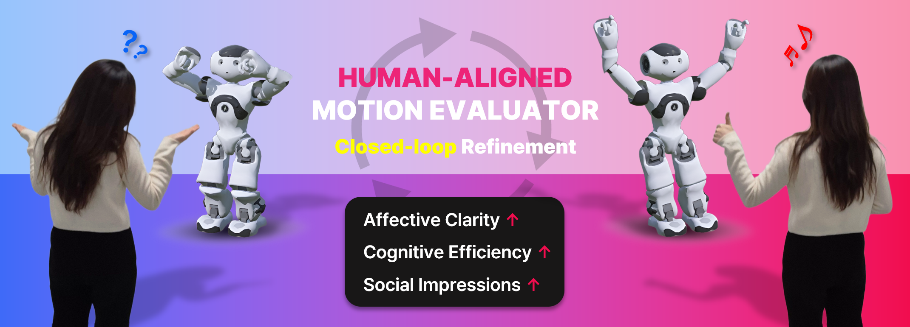
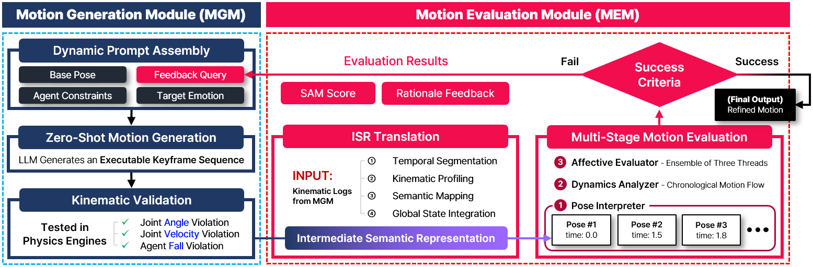

# A Perceptual-Affective Closed-loop for Emotional Expressions of Virtual Robot Agents

 

 

## 🎯 Graphical Abstract

*Figure 1: The proposed framework utilizes a human-aligned LLM motion evaluator to iteratively refine virtual agents' affective motions. This closed-loop significantly enhances affective clarity, cognitive efficiency, and positive social impressions in human-agent interactions.*

 

## ⚙️ Framework Architecture

*Figure 2: Architecture of the PACE framework. The system features an iterative "Generate-Validate-Evaluate-Refine" loop where the Motion Generation Module (MGM) and the Motion Evaluation Module (MEM) organically interact to autonomously optimize affective behaviors.*

 

## 📁 Repository Structure & File Guide

This repository contains the core instructional prompts, hardware validation logic, and the ISR Translation pipeline of the PACE framework. 

### Core Agents Prompts
- **`MEM_Prompt.py`**: The system prompts defining the **Motion Evaluation Module (MEM)**. Contains Pose Interpreter, Dynamics Analyzer, Affective Evaluator.
- **`MGM_Prompt.py`**: The system prompts defining the **Motion Generation Module (MGM)**.

### Validation & Configurations
- **`Kinematic_Validation.py`**: It filters out physical impossibilities by checking for **Joint Angle Violations**, **Joint Velocity Violations**, and **Agent Fall Violations**.
- **`pace_config.py`**: The centralized configuration file containing constant definitions, such as the `NEUTRAL_POSE` dictionary and joint semantics used by the LLM modules.
- **`joint_constraints.json`**: Physical constraints definitions mapping joint names to their operable ROM (Range of Motion) and maximum velocities.

### Intermediate Semantic Representation (ISR) Translation Pipeline
- **`ISR_Translation_Scripts/`**: A sequential post-processing pipeline.
  - `1_Temporal_Segmentation.py`
  - `2_Kinematic_Profiling.py`
  - `3_Semantic_Mapping.py`
  - `4_Global_State_Integration.py`
  - `5_Optimization.py`
